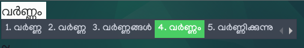
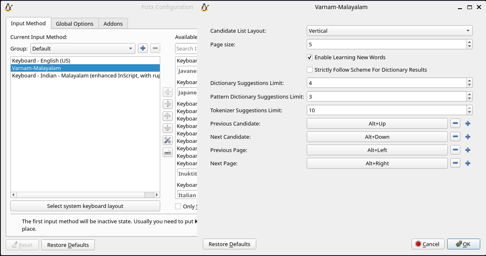

# Varnam Fcitx5

<center>



</center>


A wrapper to add Varnam Input Method Engine support in Fcitx5 Input Method.

> Please report bugs by raising [issues](https://github.com/varnamproject/varnam-fcitx5/issues), if you find any.

## Dependencies

* A C++ compiler that supports c++17 standard.
* [Varnam](https://github.com/varnamproject/govarnam)
* [Varnam Schemes](https://github.com/varnamproject/schemes/releases/)
* [Fcitx5](https://github.com/fcitx/fcitx5)
* [CMake](https://cmake.org/) (build-dep)
* fcitx5-modules-dev (build-dep on debian based distributions)
* extra-cmake-modules (build-dep)
* pkgconf (build-dep)

## Installation

### Build & Install

> [!IMPORTANT] 
> Please Uninstall the older version first, to avoid conflicts.

```bash
git clone https://github.com/varnamproject/varnam-fcitx5.git
cd varnam-fcitx5
cmake -B build/ -DCMAKE_INSTALL_PREFIX=/usr -DCMAKE_BUILD_TYPE=Release -S .
cmake --build build/ --config Release
sudo cmake --install build/ --config Release
```

or

```bash
git clone https://github.com/varnamproject/varnam-fcitx5.git
cd varnam-fcitx5
cmake -B build/ -DCMAKE_INSTALL_PREFIX=/usr
cd build && make -j4
sudo make install
```
 > CMake supports multiple build system generators including [Ninja](https://ninja-build.org/). Commands could change based on the generator you use.
 

To enable debug logs, configure the project with `-DVARNAM_DEBUG=ON` option.

```bash
cmake -B build/ -DVARNAM_DEBUG=ON -DCMAKE_INSTALL_PREFIX=/usr -DCMAKE_BUILD_TYPE=Release
```

### Uninstall

```
cd build
sudo make uninstall
```
or 

```
cd build
sudo ninja uninstall
```
---

[](https://repology.org/project/varnam-fcitx5/versions)

* [AUR Package](https://aur.archlinux.org/packages/varnam-fcitx5-git) by [@mohammedbilalns](https://github.com/mohammedbilalns)
* [Varnam Nix Flake](https://github.com/adtya/varnam-nix) by [@adtya](https://github.com/adtya)

## Configuration

Varnam Fcitx can be configured using `fcitx5-configtool`. Please refer the [official documentation](https://fcitx-im.org/wiki/Configtool_(Fcitx_5)).

<center>



</center>

| Property | Description |
-----------|-------------
| Strictly Follow Scheme For Dictionary Results | If this is turned on then suggestions will be more accurate according to [scheme](https://varnamproject.com/editor/#/scheme). But you will need to learn the [language scheme](https://varnamproject.com/editor/#/scheme) thoroughly for the best experience.|
| Enable Learning New Words | Varnam will try to **learn every new word we write by default**. This feature can be disabled through the configuration window.